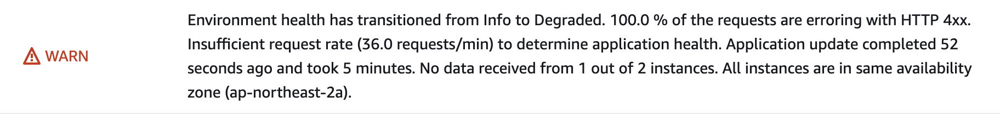

# CD
## ElasticBeansTalk

우리 팀은 서버 배포를 위해 aws의 elasticBeansTalk(EB)를 사용하기로 했다.

[https://docs.aws.amazon.com/ko_kr/elasticbeanstalk/latest/dg/Welcome.html](https://docs.aws.amazon.com/ko_kr/elasticbeanstalk/latest/dg/Welcome.html)


**EB란 간단히 말해서 쉽고 간단히 무중단 배포를 할 수 있게 해주는 툴이라고 보면 될거같다!**

개발자가 웹 애플리케이션, 모바일 백엔드 등을 개발한 후, Elastic Beanstalk에 코드를 업로드 하기만 하면 그 후의 배포 작업들은 자동으로 처리가 됩니다. 여기서 말하는 배포 작업에는 다음과 같은 작업들이 포함됩니다.

- 애플리케이션의 배포를 위해 필요한 AWS 리소스들을 생성(EC2, 로드밸런서, 오토스케일링 그룹 등)
- 애플리케이션의 가동을 위해 필요한 구성 요소 설치 (운영체제, 웹 혹은 애플리케이션 서버, 인터프리터 등)
- 애플리케이션 모니터링 구성

위와 같은 작업들을 대신해 주기 때문에 개발자는 애플리케이션을 실행하는 인프라에 대해 자세히 알 필요 없이 코드에만 집중하여 개발을 진행할 수 있습니다. 또한, Elastic Beanstalk에 대한 추가 요금이 없고 생성되는 AWS 리소스들에 대한 요금만 지불하면 되기 때문에 비용에 대한 부담도 전혀 없습니다.

## 배포 방식

EB는 배포 방식이 두가지가 있는걸로 알고 있다.

하나는 awscli를 통해 배포하는 방법


다른 하나는 코드를 압축해서 aws 홈페이지에 업로드 하는 방식


## 너무 느린 배포 속도

우리팀은 처음에는 **첫 번째** 방법으로 배포를 하고 있었다.

AWS Elastic Beanstalk(Eb) CLI를 사용하여 애플리케이션을 배포하면 eb deploy 명령을 실행할 때 해당 디렉토리의 모든 파일과 하위 디렉토리를 압축하여 AWS Elastic Beanstalk 환경으로 업로드한다.

이후 압축을 풀고 dockerfile을 빌드를 해서 애플리케이션을 실행하게 되는데 이 과정에서

**시간이 30분 이상이** 소요되고 실패하게 될 경우 배포를 또 하염없이 기다리게 되는 상황이 만들어 졌다

~~_(걸리는 시간을 사진 찍어놨어야 했는데……)_~~

## 속도 개선

그래서 우리팀은 dockerfile을 eb 환겅에서 빌드를 하지 않고 외부에서 docker image를 만들고 ecr에 넣은 후 eb 환경은 ecr에 있는 이미지만 실행시키면 되게끔 설계를 했다.

전체적인 구조는 이렇게 된다.


```yaml
{
  "AWSEBDockerrunVersion": "1",
  "Image": {
    "Name": "ecr 주소",
    "Update": "true"
  },
  "Ports": [
    {
      "ContainerPort": 8080
    }
  ]
}
```

ecr을 사용하려면 dockerrun.aws.json파일이 필요해 이렇게 구성했다.
```yaml
- name: Generate deployment package
        run: |
          mkdir -p deploy
          cp Dockerrun.aws.json deploy/Dockerrun.aws.json
          cd deploy && zip -r deploy.zip .

- name: Beanstalk Deploy
        uses: einaregilsson/beanstalk-deploy@v14
        with:
          aws_access_key: ${{ secrets.AWS_JAMIN_ACCESS_KEY }}
          aws_secret_key: ${{ secrets.AWS_JAMIN_SECRET_ACCESS_KEY }}
          application_name: ${{ env.EB_APPLICATION }}
          environment_name: ${{ env.EB_ENVIRONMENT }}
          version_label: bems-${{steps.current-time.outputs.formattedTime}}-${{ steps.sha.outputs.short }}
          region: ap-northeast-2
          deployment_package: deploy/deploy.zip
          wait_for_environment_recovery: 200
```

gicaction을 통해 ecr에 docker 이미지를 넣어두고 Generate deployment package의 실행을 통해

dockerrun.aws.json가 있는 폴더를 zip파일로 만들었다.

gitaction에서 사용할수 있는 eb action이 있어서 사용을 했고 선행과정에서 만들어진 zip파일을 가지고 eb환경에 배포하게 된다.

## Health Check

이렇게 구성하고 설레는 마음으로 배포를 했지만



읭? 이런 로그를 남기면서 배포에 실패하게 된다……

자료를 조금 더 찾아보니 eb를 배포하게 될때 로드밸런서가 자동으로 “/”로 request를 보내 health check를 하게 되는데 우리 서버는 로그인이 안되어있으면 401 상태값을 리턴하게 되있다

오? 맞다!

 

이 사실을 알고 헐레벌떡 health라는 무조건 통과하는 api를 만들고


로드밸런서 healch check의 path를 /health로 바꿨다

## 결과


이럴수가 4분만에 배포가 완료되는 모습이 보인다!! ㅎㅎ

무려 배포시간을 7배정도나 개선시키게 되었다!


