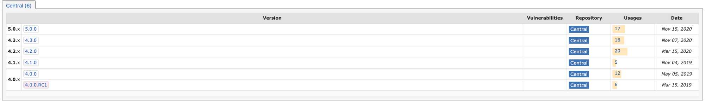
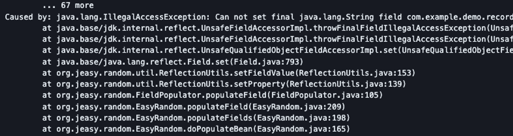
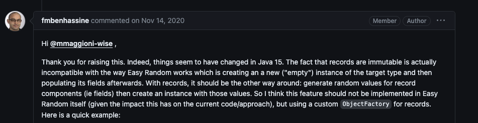
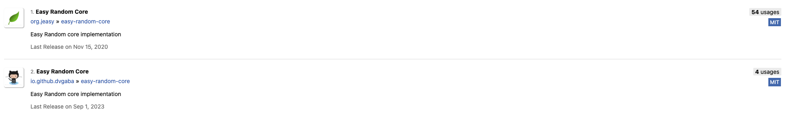

## easy random

테스트 객체를 쉽게 만들기 위해 easy random을 선택하게 되었는데


최신이라고 생각했던 5.0버전을 사용하다가 record는 final 필드라서 랜덤한 객체를 만들 수 없다는 버그가 생겼다.





easy random은 기본적으로 빈 객체를 만들고 필드를 채우는 방식인데 record와 호환되지 않는다고 되어있다

[Add support to generate random Java Records · Issue #397 · j-easy/easy-random](https://github.com/j-easy/easy-random/issues/397)

이슈를 쭉 일어 보다가 record 문제를 해결한 버전이(6.x.x)가 나와서 maven repo에 올렸다고 해서 찾아 봤는데


다른 레포에 올라와져 있어서 못찾고 있었다 ㅜㅜ

## Instancio

레포지토리를 못찾는 삽질을 하는 동안 위 깃허브 이슈 글에서


새로운 라이브러리를 추천해줘서 한번 사용하게 되었는데

[User Guide - Instancio](https://www.instancio.org/user-guide/)

내 생각에는 easy random 보다 좀 더 직관적이고 사용하기 쉬운거 같다

기본적인 생성 예시를 보면

### 객체 생성

```java
// shorthand
Instancio.create(Class<T> type)
// builder
Instancio.of(Class<T> type).create()
// 리스트 생성
List<Person> list = Instancio.ofList(Person.class).size(10).create();
// stream 생성
List<Person> personList = Instancio.stream(Person.class)
    .limit(3)
    .collect(Collectors.toList());
```

### 객체 값 설정

```java
Address address = Instancio.of(Address.class)
    .set(field(Address.class, "city"), "bar")
    .create();
```

### 객체 안에 객체 값 설정

```java
class Person {
    String name;
    Address homeAddress;
    Address workAddress;
}

class Address {
    String street;
    String city;
}

Scope homeAddress = field(Person::getHomeAddress).toScope();
Scope workAddress = field(Person::getWorkAddress).toScope();

Person person = Instancio.of(Person.class)
    .set(field(Address::getCity).within(homeAddress), "foo")
    .set(field(Address::getCity).within(workAddress), "bar")
    .create();
```

### easy random 비교

```java
public static ControlPointAndValue 관제점_관제값_랜덤_생성(BigDecimal value) {
		List<ControlValueQuery> controlValueQueries = IntStream.range(0, 10)
			.mapToObj(i -> Instancio.of(ControlValueQuery.class).set(all(BigDecimal.class), value).create())
			.toList();
		return Instancio.of(ControlPointAndValue.class)
			.subtype(all(ControlPointQueryInterface.class), ControlPointWithFloorZoneQuery.class)
			.set(field("controlValues"), controlValueQueries)
			.create();
	}

	public static ControlPointAndValue 관제점_관제값_랜덤_생성_easy(BigDecimal value) {
		EasyRandomParameters valueRandomize = new EasyRandomParameters()
			.randomize(BigDecimal.class, () -> value);
		List<ControlValueQuery> controlValueQueries = new EasyRandom(valueRandomize).objects(ControlValueQuery.class,
			10).toList();

		EasyRandomParameters randomize = new EasyRandomParameters()
			.randomize(ControlPointQueryInterface.class,
				() -> new EasyRandom().nextObject(ControlPointWithFloorZoneQuery.class))
			.randomize(field -> field.getName().equals("controlValues"), () -> controlValueQueries);

		return new EasyRandom(randomize).nextObject(ControlPointAndValue.class);
	}
```

## 결론

둘 중에 어떤걸 쓸지 고민하다가 instancio 가 아파치 라이선스도 있고

릴리즈를 조금 더 자주하고 최신꺼 같아서 instancio를 사용하기로 했다!

그리고 easyrandom을 사용하는 팀원말에 의하면 cyclic object(jpa 양방향 설정 등)을 제대로 처리 못한다고 한다
~~해보지는 않았음....~~


instancio


easy random
