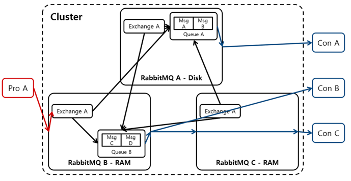
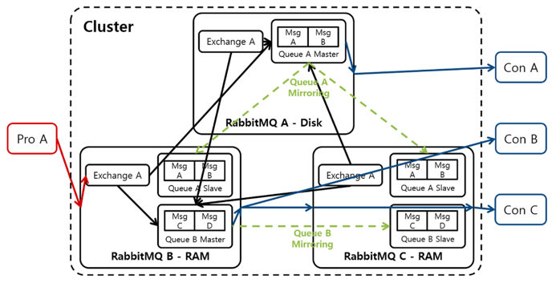
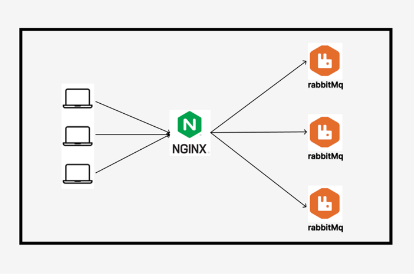
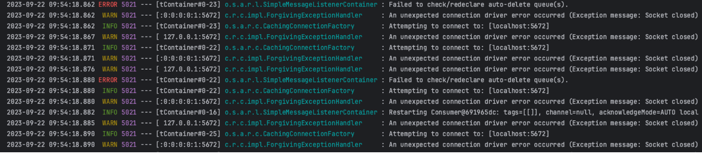

## 단일 노드의 문제점

- 단일 노드에서 장애가 발생하면 전체 서비스가 중단될 위험이 있다.
- 트래픽이 증가하면 단일 노드에서는 처리 능력에 한계가 생길수가 있다.
- 서버자원을 효율적으로 사용하기 어렵다.

이러한 문제점 때문에 단일 노드로 운영되고 있는 rabbitmq 서비스를 cluster모드를 도입하기로 결정했다.

## Cluster Mode



- 다수의 RabbitMQ 노드(RabbitMQ가 설치된 서버)를 마치 하나의 RabbitMQ를 사용하는 것처럼 사용할 수 있는 기법이다, 위 그림처럼 클러스터에 노드가 3개 존재한다면 어떤 노드에 연결해도 나머지 두 개 노드의 RabbitMQ에 접근할 수 있다.
- **RabbitMQ는 Queue를 제외한 모든 정보를 공유한다.** 따라서 동일한 Cluster안에 있는 모든 RabbitMQ는 동일한 Exchange를 갖고 있다.
- 클러스터에 속한 노드들은 Erlang Cookie라는 비밀 쿠키 파일을 통해 서로 통신해도 되는지에 대해서 파악한다. **클러스터에 소속된 노드들은 같은 Erlang Cookie를 가지고 있어야만 서로 통신이 가능**하기 때문에 모든 노드들이 반드시 같은 쿠키 파일을 가지고 있어야 한다.

## Mirroring mode

- **RabbitMQ Mirroring은 RabbitMQ Cluster 안에서 Meesage를 다수의 RabbitMQ에 복사하여 저장하는 기법이다.**
- Clustering은 Queue를 제외한 모든 정보를 공유하기 때문에 MIrroring은 메시지가 담겨있는 Queue에 대한 보호 장치라고 생각하면 된다.
- Master Queue는 원본 Queue를 의미하며 Slave Queue는 Master Queue를 복제한 Queue를 의미하고, 각 Master Queue마다 다른 개수의 Slave Queue를 설정 할 수 있다

## Nginx


먼저 3개의 rabbitmq노드에 골고루 정보를 주기위해 중간 로드 벨런서로 nginx를 선택하였다.

### AMQP 프로토콜

처음에 프록시를 설정할때 이런식으로 사용했더니 제대로 적용이 안되는 상황이 나왔다.

```java
http{
	...
	server{
		...
	}
}
```

알고보니 rabbitqm의 프로토콜이 **AMQP**프로토콜이라 http랑 연결이 안되는 거였다.

AMQP는 TCP를 기반으로 동작하는 바이너리 프로토콜으로

nginx의 stream모듈을 사용하니 잘되는 모습을 보였다.

```java
stream {
    upstream rabbitmq_cluster {
        server rabbit1:5672 max_fails=3 fail_timeout=10s;
        server rabbit2:5672 max_fails=3 fail_timeout=10s;
        server rabbit3:5672 max_fails=3 fail_timeout=10s;
    }

    server {
        listen 5672;
        proxy_pass rabbitmq_cluster;
    }
}
```

## cluster mode 설정

클러스터 모드 설정은 간단하게

```java
			
  rabbitmqctl stop_app
  rabbitmqctl join_cluster rabbit@rabbit1
  rabbitmqctl change_cluster_node_type disk
  rabbitmqctl start_app

```

실행하던 rabbitmq 서버를 멈추고 join 시킨후 다시 키면 끝이다.

처음 클러스터 모드를 설정하고 노드가 하나가 꺼져도 잘 되겠지라는 생각에 노드를 껐더니 이런 에러가 나왔다…


에러 내용을 보면 그냥 연결할 수 없다 라고 나오는데 분명히 다른 노드에 연결이 되어있을텐데 왜 안될까 하다가

결국 돌아돌아 클러스터 모드에대해 다시 공부하니

**`RabbitMQ는 Queue를 제외한 모든 정보를 공유한다.`** 라는 중요한 정보를 놓치고 있었다. 내가 종료한 노드가 q를 가지고 있는 노드라서 연결이 안되고 있었던 것이다.

### mirroring mode 설정

`rabbitmqctl set_policy -p /local(환경에 맞게 변경) ha-all ".*" '{"ha-mode":"all","ha-sync-mode":"automatic"}'`

그래서 중간에 노드가 꺼져도 계속 연결을 유지할 수 있도록 mirroring모드를 rabbitmq1 에 설정을 해주면

다른 노드에서도 똑같은 q를 가지고 있어 노드 하나가 꺼지더라도 계속 작업을 이어갈 수 있게 되었다.

# 참고

- https://jhyonhyon.tistory.com/76
- https://jhyonhyon.tistory.com/77?category=966563
- [https://backtony.github.io/spring/2021-09-21-spring-rabbitmq-1/#클러스터란](https://backtony.github.io/spring/2021-09-21-spring-rabbitmq-1/#%ED%81%B4%EB%9F%AC%EC%8A%A4%ED%84%B0%EB%9E%80)
- [https://velog.io/@zuckerfrei/Nginx-TCP-Proxy-서버](https://velog.io/@zuckerfrei/Nginx-TCP-Proxy-%EC%84%9C%EB%B2%84)