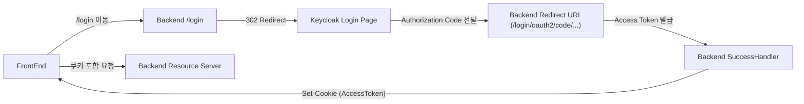
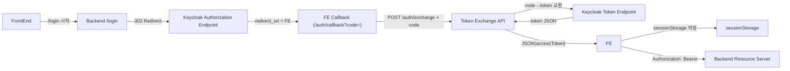

# Spring Security + Keycloak

최근 나는 Spring Security + Keycloak 기반 OAuth2 로그인을 사용하고 있었다.  
처음 구현은 흔히 많이 하는 구조였다.

> “백엔드가 Keycloak 로그인 후 token을 받아서 FE에게 쿠키로 내려주는 방식”

그리고 sessionStorage 기반 OAuth2(BFF 패턴)으로 전환하게 되었다.

---

# 1. 처음 겪은 문제

## “왜 axios로 POST하면 403 CSRF가 뜨는데, form.submit()은 잘 되지?”

처음 만난 증상은 단순 CSRF 문제가 아니었다.

하지만 실제 원인을 보려면 **이전 Spring Security 코드**부터 보자.

```kotlin
@Bean
fun securityFilterChain(http: HttpSecurity): SecurityFilterChain =
    http
        .cors { it.configurationSource(corsConfigurationSource) }
        .csrf {
            it.csrfTokenRepository(CookieCsrfTokenRepository.withHttpOnlyFalse())
            it.ignoringRequestMatchers(DispatcherTypeRequestMatcher(DispatcherType.ERROR))
        }
        .formLogin { it.disable() }
        .sessionManagement { it.sessionCreationPolicy(SessionCreationPolicy.STATELESS) }
        .authorizeHttpRequests {
            it.anyRequest().authenticated()
        }
        .oauth2Login { oauth ->
            oauth.authorizationEndpoint { it.baseUri("/member/api/oauth2/authorization") }
            oauth.redirectionEndpoint { it.baseUri("/member/api/login/oauth2/code/*") }
            oauth.successHandler { req, res, auth -> onSuccess(req, res, auth) }
        }
        .oauth2ResourceServer { rs ->
            rs.bearerTokenResolver { resolveFromCookie(req) }
            rs.jwt { jwt -> jwt.jwtAuthenticationConverter(customJwtConverter) }
        }
        .logout { logout ->
            logout.logoutUrl("/member/api/logout")
            logout.logoutSuccessHandler { req, res, _ -> onLogout(req, res) }
        }
        .build()
```

##  여기에서 발생했던 핵심 문제점

###  **Resource Server가 활성화되면 CSRF는 자동 비활성화됨**

→ 그런데 나는 따로 CSRF Token Repository를 설정하고 있었음  
→ 즉, “CSRF가 활성화된 것처럼 보이지만 실제로는 무시되는 상태”

그래서:
- form.submit() → 정상
- axios POST → 403
- 요청마다 다르게 동작

이런 **이해되지 않는 증상**이 나타났던 것이다.
https://github.com/spring-projects/spring-security/issues/8668

---

###  redirect-uri가 BE로 되어 있어 FE가 token을 받을 수 없음

이전 redirect-uri:

```
redirect-uri: "{baseUrl}/member/api/login/oauth2/code/keycloak"
```

- Keycloak → BE
    
- BE가 successHandler에서 쿠키 만들어 FE에게 내려줌

→ FE는 token을 직접 알 수 없음  
→ sessionStorage 기반 구조 절대 불가능

---

### successHandler가 token을 HttpOnly 쿠키에 저장

```kotlin
res.addHeader(
    HttpHeaders.SET_COOKIE,
    buildCookie(name = "KC_ACCESS", value = accessToken.tokenValue)
)
```

이로 인해:
- FE는 token을 알 수 없음
- axios 헤더 인증 불가
- SPA 전용 인증 로직 구축 불가 
- refresh token 갱신 제어 불가

---

### oauth2Login() 이 구조 자체를 “백엔드 전용 로그인 흐름”으로 고정시킴

즉:
- 로그인 시작
- 리다이렉트
- code 수신
- token 교환
- 쿠키 저장

모든 단계가 **백엔드가 주도**하는 플로우.  
SPA에서는 절대 적합하지 않은 구조다.

### 쿠키의 크기 제한 문제

회원에 그룹을 추가하거나 정보를 추가할때마다 jwt의 크기가 커지는데 이로인해

쿠키로는 프론트에게 정보를 전달할 수 없는 상황이 나왔다.

---

#  기존 코드가 가진 구조적 문제

| 문제                     | 설명                         |
| ---------------------- | -------------------------- |
| FE는 token을 절대 받을 수 없음  | redirect-uri가 BE임          |
| 쿠키 기반 + Bearer 기반이 혼합됨 | 구조 혼란 발생                   |
| CSRF 설정은 실제로 동작 안 함    | resourceServer가 이미 disable |
| SPA 전용 인증 구현 불가능       | FE가 사용자 상태 알 수 없음          |
| 전체 흐름이 BE 주도           | 현대 SPA와 맞지 않음              |

---

#  “FE가 Authorization Code를 직접 받아 FE가 token을 보관하는 구조로 변경하는 것”

## SessionStorage 기반 OAuth2

이 구조는 다음과 같다:

```
FE → BE → Keycloak → FE → BE → FE
```

## 도식화

## 기존 구조 — 쿠키 기반



---

## 최종 구조 — SessionStorage 기반 OAuth2



---

# 4. 실제 코드

## 1. Keycloak redirect-uri 를 FE로 변경

```
https://frontend.com/auth/callback
```

---

##  Spring Security 설정

```kotlin
@Bean
fun securityFilterChain(http: HttpSecurity): SecurityFilterChain =
    http
        .cors { it.configurationSource(corsConfigurationSource) }
        .csrf { it.disable() }
        .sessionManagement { it.sessionCreationPolicy(SessionCreationPolicy.STATELESS) }
        .authorizeHttpRequests {
            it.requestMatchers("/login", "/auth/exchange").permitAll()
            it.anyRequest().authenticated()
        }
        .oauth2Client { } // token 교환용
        .oauth2ResourceServer { rs ->
            rs.jwt { jwt -> jwt.jwtAuthenticationConverter(customJwtConverter) }
        }
        .build()
```

---

##  로그인 시작

```kotlin
@Tag(name = "로그인", description = "로그인 API")  
@Controller  
class LoginRedirectController(  
  private val clientRegistrationRepository: ClientRegistrationRepository,  
) {  
  @Operation(summary = "로그인", description = "Keycloak OAuth2 인가 엔드포인트로 리다이렉트합니다.")  
  @GetMapping("/login")  
  fun login(): String {  
    val client = clientRegistrationRepository.findByRegistrationId("keycloak")  
    val authUri = client?.providerDetails?.authorizationUri  
      ?: error("authorizationUri not found")  
  
    val redirectUri = UriComponentsBuilder  
      .fromUriString(authUri)  
      .queryParam("client_id", client.clientId)  
      .queryParam("redirect_uri", "https://your-fe-domain/auth/callback")  
      .queryParam("response_type", "code")  
      .queryParam("scope", "openid", "profile", "email")  
      .build(true)  
      .toString()  
  
    return "redirect:$redirectUri"  
  }  
}
```

---

##  Code → Token 교환 API

```kotlin
@RestController
@RequestMapping("/auth")
class AuthExchangeController(
    private val clientRegistrationRepository: ClientRegistrationRepository,
    private val restTemplate: RestTemplate = RestTemplate()
) {

    @PostMapping("/exchange")
    fun exchange(@RequestBody req: CodeRequest): TokenResponse {
        val client = clientRegistrationRepository.findByRegistrationId("keycloak")
            ?: error("Client not found")

        val params = LinkedMultiValueMap<String, String>().apply {
            add("grant_type", "authorization_code")
            add("code", req.code)
            add("redirect_uri", req.redirectUri)
            add("client_id", client.clientId)
            add("client_secret", client.clientSecret)
        }

        val response = restTemplate.postForObject(
            client.providerDetails.tokenUri, params, Map::class.java
        )!!

        return TokenResponse(
            accessToken = response["access_token"].toString(),
            refreshToken = response["refresh_token"]?.toString()
        )
    }
}

data class CodeRequest(val code: String, val redirectUri: String)
data class TokenResponse(val accessToken: String, val refreshToken: String?)
```

---

##  FE callback 페이지

```tsx
useEffect(() => {
  const params = new URLSearchParams(window.location.search);
  const code = params.get("code");
  if (!code) return;

  const api = import.meta.env.VITE_API_URL;

  fetch(`${api}/auth/exchange`, {
    method: "POST",
    headers: { "Content-Type": "application/json" },
    body: JSON.stringify({
      code,
      redirectUri: window.location.origin + "/auth/callback"
    })
  })
  .then(res => res.json())
  .then(tokens => {
    sessionStorage.setItem("accessToken", tokens.accessToken);
    if (tokens.refreshToken)
      sessionStorage.setItem("refreshToken", tokens.refreshToken);

    window.location.href = "/";
  });
}, []);
```

# 참고

**RFC 6749 – Section 4.1.3 Access Token Request** [IETF Datatracker](https://datatracker.ietf.org/doc/html/rfc6749)

> **“4.1.3. Access Token Request**
> 
> **The client makes a request to the token endpoint by sending the  
> following parameters using the "application/x-www-form-urlencoded"  
> format per Appendix B with a character encoding of UTF-8 in the HTTP  
> request entity-body:**
> 
> **grant_type**  
>     _REQUIRED. Value MUST be set to "authorization_code"._
> 
> **code**  
>     _REQUIRED. The authorization code received from the  
>     authorization server._

여기서 볼 수 있는 포인트:

- **토큰 엔드포인트에 요청하는 주체 = “the client”**
    
- 이 “client”는 RFC에서 **OAuth 클라이언트 애플리케이션(대부분 서버)** 를 의미하고, 브라우저(리소스 오너의 user-agent)가 아님.


---


**RFC 8252 – Section 8.2 “OAuth 2.0 Implicit Grant”** [IETF Datatracker](https://datatracker.ietf.org/doc/rfc8252)

> **“The OAuth 2.0 implicit grant authorization flow (defined in  
> Section 4.2 of OAuth 2.0 [RFC6749]) generally works with the practice  
> of performing the authorization request in the browser and receiving  
> the authorization response via URI-based inter-app communication.  
> However, as the implicit flow cannot be protected by PKCE [RFC7636]  
> (which is required in Section 8.1), the use of the Implicit Flow with  
> native apps is NOT RECOMMENDED.”**

여기서:

- **Implicit Flow = 토큰을 브라우저로 바로 주는 방식**
    
- 이걸 **native apps에서 NOT RECOMMENDED**라고 못 박고 있음.
    

그래서 요즘 “FE가 auth server에게 access token을 직접 받는 그림”이  
→ 사실상 이 implicit 패턴이라서, 최신 BCP 기준으론 **쓰지 말라고 된 것**.


여기서 하는 얘기는 딱 **리다이렉트 URI 등록 규칙**임. [IETF Datatracker+1](https://datatracker.ietf.org/doc/html/rfc8252)

> _“Authorization servers MUST require clients to register their complete  
> redirect URI (including the path component) and reject authorization  
> requests that specify a redirect URI that doesn't exactly match the  
> one that was registered…”_

즉:

- “exact redirect_uri match 해라”
    
- “reverse domain 기반 private scheme 써라”_