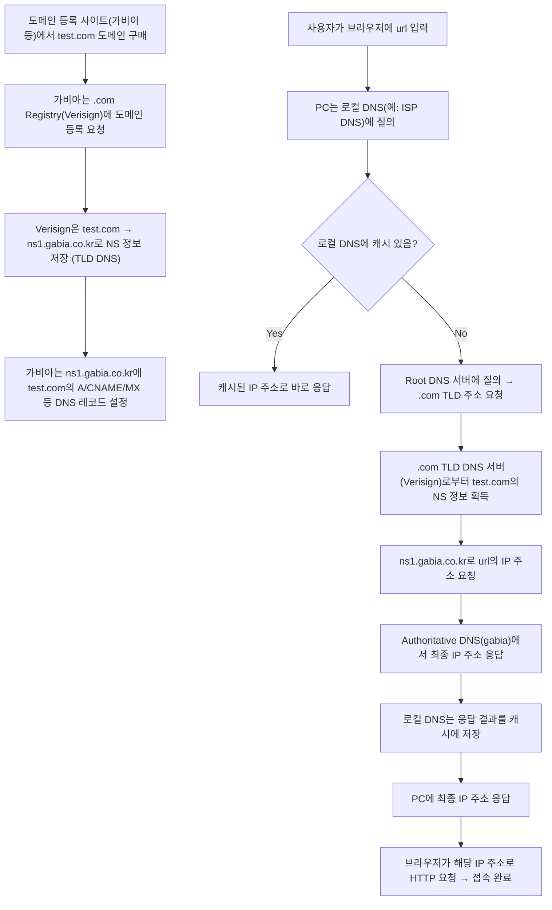

## DNS란

DNS(Domain Name System)는 도메인 이름을 IP 주소로 변환해주는 시스템입니다.
우리는 www.naver.com 같은 도메인을 입력하지만, 컴퓨터는 오직 숫자인 IP 주소(예: 223.130.195.200)로 통신하기 때문에, 이 둘 사이를 이어주는 번역기가 바로 DNS입니다.

핵심 역할:
- 도메인 → IP 주소 변환
- 인터넷의 전화번호부
- TCP/IP 통신의 출발점

### **1. 분산형 구조**

DNS는 전 세계의 수십억 개 도메인을 처리해야 하므로, 하나의 서버가 모든 정보를 갖고 있을 수 없습니다.
그래서 DNS는 **계층적이고 분산된 구조**로 이루어져 있으며, 각 레벨이 특정 역할을 나눠서 처리합니다.

DNS는 트리 형태의 구조를 가짐:
- .com → 최상위 도메인 (TLD)
- naver → Second-level 도메인
- www → 호스트 이름 

각 도메인 영역(zone)은 독립적으로 관리되고, 정보는 분산된 네임서버들에 의해 유지됩니다.
#### **Zone이란?**

> **Zone**은 DNS에서 **하나의 네임서버 세트가 책임지고 관리하는 도메인 영역**입니다.
> 즉, DNS 레코드들이 실제로 **저장되고 응답되는 범위**예요.

- Zone은 “도메인 이름 공간”의 **데이터 저장 단위**
-  A, CNAME, MX, NS 같은 **레코드들이 저장된 범위**
- **관리자(네임서버)의 책임 범위**라고 생각하면 됩니다

| **구성 요소** | **용어**           | **예시**          |
| --------- | ---------------- | --------------- |
| 최상위 도메인   | TLD              | .com, .net, .kr |
| 도메인 이름    | Domain           | test.com        |
| 서브도메인     | Subdomain / Host | www, blog, mail |
| 전체 주소     | 정규화 도메인 이름       | www.test.com    |

### 2. DNS 흐름

사용자가 브라우저에 www.naver.com을 입력하면 다음과 같은 단계로 DNS 질의가 진행됩니다.
1. PC는 **로컬 DNS 캐시**에서 먼저 확인
2. 캐시에 없으면 **ISP DNS 서버**에 질의
3. ISP DNS도 없으면 → **Root DNS**에 질의
4. Root DNS → .com을 관리하는 **TLD DNS** 주소 반환
5. .com TLD DNS → naver.com을 관리하는 **네임서버(NS)** 반환
6. NS → www.naver.com의 IP 주소 반환
7. IP 주소를 받아 웹서버에 접속
  
요약하면: **로컬 캐시 → ISP DNS → Root → TLD → NS → 최종 IP**

### 3. DNS 캐시

DNS 응답 결과는 반복적으로 사용되는 경우가 많기 때문에, **캐시(Cache)** 를 통해 처리 속도를 빠르게 합니다.
운영체제, 브라우저, ISP DNS 모두 캐시를 보관하며, 일정 시간(TTL) 동안은 재질의 없이 그대로 사용합니다.
- PC에서는 ipconfig /displaydns로 확인 가능
    
- TTL이 만료되면 다시 DNS에게 질의함

### 4. hosts 파일

Windows 등 운영체제에는 hosts 파일이라는 것이 존재합니다.
이 파일에는 특정 도메인에 대응되는 IP 주소를 수동으로 지정할 수 있으며, DNS보다 우선됩니다.

- 보안 프로그램이 hosts 파일을 보호하는 이유
    
- 과거에는 악성코드가 이 파일을 조작해 피싱 사이트로 유도하기도 함

### 5. DNS 해킹

DNS는 인터넷 보안의 첫 관문입니다.
만약 DNS 서버가 공격을 받아 잘못된 IP 주소를 응답하면, 사용자는 정상적인 도메인 이름을 입력했음에도 피싱 사이트로 접속하게 될 수 있습니다.

이런 공격을 **DNS 스푸핑** 또는 **캐시 포이즈닝**이라고 합니다.
이를 방지하기 위해 DNSSEC 같은 보안 프로토콜도 도입되고 있습니다.

### **6. 도메인을 구매**

 test.com이라는 도메인을 가비아에서 구매했다고 가정해 합니다.
그 순간 DNS 세계에서는 다음과 같은 절차가 일어납니다.

도메인 등록 과정:
1. 가비아(Registrar)는 .com을 관리하는 **Verisign(Registry)** 에 등록 요청
2. Verisign은 .com TLD DNS에 다음 정보 저장:
    - 도메인 이름: test.com
    - 관리 네임서버(NS): ns1.gabia.co.kr
3. 가비아는 Authoritative DNS인 NS 서버에 다음 정보 등록:
    - A 레코드: www.test.com → 123.123.123.123
    - MX, CNAME 등 부가 정보


### 7. 이후접속
1. 사용자가 주소창에 www.test.com 입력
2. 브라우저는 DNS 질의 시작
3. 캐시 없을 경우 → Root → .com TLD → ns1.gabia.co.kr 순으로 따라감
4. gabia 네임서버에서 IP 주소 응답 → 웹서버 접속

- **TLD DNS는 NS 정보만 알고 있음**
- **실제 IP는 Authoritative DNS(NS 서버)가 알고 있음**
- **Root DNS는 오직 TLD들의 위치만 알고 있음**




---
## 웹 기술의 창시자


웹의 시초는 **유럽 입자물리연구소(CERN)** 에서 시작됩니다.
바로 이곳에서 컨설턴트로 근무하던 **팀 버너스리(Tim Berners-Lee)** 가
웹의 핵심 기술들을 창안하게 되었죠.

- 입자물리연구소에서 **정보검색 시스템 구축**
- 연구원들이 **논문을 참고문헌 기반으로 계속 넘나들며** 정보를 찾는 걸 보며,
    → “문서 간 연결이 자연스러우면 좋겠다”는 문제의식을 가짐
- 그래서 고안한 것이 바로 **HTML**
    → 문서에서 링크를 클릭해 다른 문서로 이동할 수 있는 **하이퍼텍스트 개념**을 구현

> 팀 버너스리는 문서를 연결하는 기술(HTML)을 만들었고,
> 그것을 인터넷 위에서 전달하기 위한 방법(HTTP)을 설계했습니다.

결국에는  파일을 쉽고 연결성 있게 보기 위한 목적에 만들어졌다.

---
## URL과 URI

### 1. URI와 URL의 차이

- **URI(Uniform Resource Identifier)**
    → **자원을 식별**하는 “이름표”입니다.
- **URL(Uniform Resource Locator)**
    → 그 중에서도 **자원이 위치한 경로를 가리키는 것**, 즉 “주소”입니다.

> 모든 URL은 URI다. 하지만 모든 URI가 URL인 것은 아니다.

### **2. Resource**

웹에서 리소스(Resource)는 결국 **파일**입니다.
대표적으로는 HTML 파일이 있지만,
- HTML 문서
- CSS 파일
- JavaScript 파일
- 이미지(jpg, png 등)
- 데이터 (JSON, XML 등)
- 서버 내부의 API 결과
도 파일에 해당한다.

### 3. URI 구조

```
scheme ":" ["//" authority] path ["?" query] ["#" fragment]

쉽게 바꿨을 때
Protocol://Address:port/path?parameter=value
```

| **구성 요소**     | **의미**              | **예시**                          |
| ------------- | ------------------- | ------------------------------- |
| **scheme**    | 어떤 프로토콜로 접근할지       | http, https, ftp                |
| **authority** | 접속 대상 주소 (도메인 + 포트) | www.test.co.kr:80               |
| **path**      | 서버 내의 자원 경로         | /course.do                      |
| **query**     | 요청 파라미터             | ?cmd=search&search_keyword=Test |
| **fragment**  | 문서 내 특정 위치          | #section1                       |
### **4. URI의 경로(path)는 ‘파일 경로’다**

  이 path는 웹 서버에서 실제 파일이 위치한 경로를 의미합니다.

- 브라우저에서 http://www.test.co.kr/을 입력하면
    실제로는 http://www.test.co.kr/index.html을 요청한 것과 같습니다.
- 이 파일은 서버에서 /root/data/index.html 같은 절대경로에 있을 수 있습니다.
- 그러나 사용자는 주소창에 전체 경로를 쓰지 않고도 접속 가능하죠.
    → 이는 서버가 기준 디렉터리를 정해두고, **상대 경로**로 응답하기 때문입니다.

### **5. 쿼리 파라미터(Query Parameter)의 사용**

URI 뒤에 붙는 ?key=value 형식은 서버에 전달할 **데이터 요청 조건**입니다.


> URL = **식별 + 위치 정보**
> URI = **식별**
> 그리고 그 자원(resource)은 결국 HTML, 이미지, API 응답 같은 **웹 상의 파일들** 입니다.

---
## **HTTP**
**HTTP** 는 **HTML 문서를 전송하기 위해 만들어진 애플리케이션 계층의 통신 프로토콜**입니다.

- 1996년: HTTP/1.0 등장
- 1999년 6월: HTTP/1.1 정식 발표
- 클라이언트-서버 모델 기반의 **요청/응답 구조**

HTML뿐만 아니라 이미지, JSON, CSS, JS 등 **웹 리소스 전반을 전송**하는 데 사용됩니다.


### **1. HTTP의 기본 구조**

HTTP는 TCP 위에서 동작하며,
**L7 계층의 텍스트 기반 프로토콜**입니다.
즉, **모든 메시지가 문자열**로 표현되어 이해하기 쉽습니다.
- 요청(request) → 서버로 문서 요청
- 응답(response) → 서버가 문서 반환

요청과 응답 모두 **HTTP 메시지 형식**으로 구성됨
핵심은 **Header + Body**의 구조

### **2. HTTP 메서드 (Method)**

  클라이언트가 서버에 “무엇을 하길 원하는지”를 나타내는 방식입니다.

| **메서드**     | **설명**                            |
| ----------- | --------------------------------- |
| **GET**     | 서버에 데이터 요청 (다운로드 개념)              |
| **POST**    | 서버에 데이터 전송 (업로드 개념, 예: 로그인, 회원가입) |
| **PUT**     | 자원 전체를 업데이트                       |
| **DELETE**  | 자원 삭제 요청                          |
| **HEAD**    | GET과 유사하지만 본문 없이 헤더만 요청           |
| **OPTIONS** | 지원 가능한 메서드 조회                     |
| **CONNECT** | 프록시 터널 생성                         |
| **TRACE**   | 경로 추적 요청                          |

### **3. HTTP 요청의 구조**

요청은 다음과 같은 정보들을 헤더에 포함합니다:

| **필드**              | **설명**                        |
| ------------------- | ----------------------------- |
| **Request URL**     | 요청 대상의 경로 (예: /)              |
| **HTTP Version**    | 사용 중인 HTTP 버전 (예: HTTP/1.1)   |
| **Host**            | 요청 대상의 도메인 (예: www.naver.com) |
| **User-Agent**      | 클라이언트 브라우저 및 OS 정보            |
| **Accept**          | 허용 가능한 MIME 타입 (예: text/html) |
| **Accept-Language** | 허용 언어 설정 (예: ko-KR)           |
| **Accept-Encoding** | 압축 방식 (예: gzip, deflate)      |
| **Referer**         | 요청이 어디에서 왔는지                  |
| **Cookie**          | 클라이언트가 저장한 쿠키 정보 전달           |

### **4. HTTP 응답(Response)의 구조**

서버는 요청에 대한 응답으로 아래와 같은 헤더를 보냅니다:

| **필드**               | **설명**                     |
| -------------------- | -------------------------- |
| **HTTP Version**     | 서버 응답 버전                   |
| **Status Code**      | 응답 결과 상태 (예: 200 OK)       |
| **Content-Type**     | 반환된 데이터의 형식 (예: text/html) |
| **Content-Encoding** | 데이터 인코딩 방식 (예: gzip)       |
| **Set-Cookie**       | 서버가 클라이언트에 저장시키는 쿠키        |
| **Date**             | 응답이 생성된 날짜                 |
| **Content-Length**   | 응답 본문의 바이트 크기              |


### **5. HTTP 상태 코드 (Status Code)**

| **코드**                        | **의미**             |
| ----------------------------- | ------------------ |
| **200 OK**                    | 요청 정상 처리           |
| **201 Created**               | 요청 성공 + 새로운 자원 생성  |
| **301 Moved Permanently**     | 영구적으로 URL이 변경됨     |
| **302 Found**                 | 일시적인 리다이렉션         |
| **400 Bad Request**           | 잘못된 요청 (문법 오류 등)   |
| **403 Forbidden**             | 권한 없음, 접근 금지       |
| **404 Not Found**             | 요청한 리소스가 없음        |
| **500 Internal Server Error** | 서버 내부 오류로 요청 처리 실패 |
