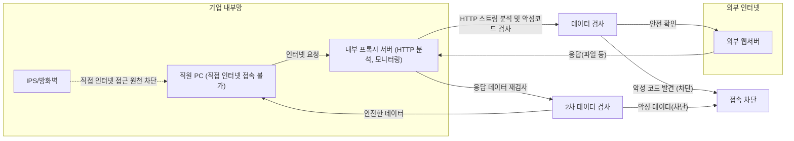

## **네트워크 장치의 세 가지 구성 구조 (Inline, Out-of-Path, Proxy)**

네트워크 장치는 크게 **인라인(Inline)**, **아웃오브패스(Out-of-Path)**, 그리고 **프록시(Proxy)** 세 가지 구조로 나눌 수 있습니다.

### **1. 인라인(Inline) 구조**

인라인 구조는 말 그대로 네트워크 흐름의 경로상에 직접 위치하여 패킷 데이터를 제어하거나 조정합니다. 패킷이 장치를 직접 통과해야 합니다.
- 데이터 처리 방식: 패킷 단위로 데이터를 처리합니다.
    
- **기능 및 역할**:
    - 통과 여부 결정(허용 또는 차단)
    - 경로 선택 및 바이패스 결정 가능
    - 대표적인 장치: 라우터, 방화벽 등

인라인 구조는 주로 다음과 같은 경우 유용합니다.
- 특정 트래픽을 필터링하거나 차단이 필요한 경우
- 경로 지정을 통해 네트워크 성능 최적화가 필요한 경우

> 예: 라우터가 인라인 구조의 가장 전형적인 예시입니다. 라우터는 네트워크 경로 상에 위치하여 패킷을 적절히 전달하거나 차단하는 역할을 수행합니다.

### **2. 아웃오브패스(Out-of-Path) 구조**

아웃오브패스 구조는 네트워크 경로 밖에서 패킷을 복사하여 분석만 수행하는 구조입니다. 실시간으로 패킷의 흐름에 간섭하지 않고, 주로 정보를 수집하고 분석하는 목적으로 활용됩니다.
- **데이터 처리 방식**: 패킷 데이터를 읽기만 하며, 제어하거나 차단하지 않습니다.
    
- **기능 및 역할**:
    - 보안 위협 탐지(IDS: Intrusion Detection System)
    - 네트워크 장애 진단 및 모니터링
    
- **연결 방식**
    - 네트워크 내 ‘탭(Tap)’ 장치를 이용하여 패킷을 복사하여 수집
    - 센서 장치로 사용하여 데이터 분석 및 진단 수행

주요 특징은 다음과 같습니다.
- 네트워크의 성능에 영향을 최소화
- 데이터 분석을 통해 네트워크 상황을 지속적으로 모니터링 가능

> 예: IDS 장치나 네트워크 성능 모니터링 도구들이 아웃오브패스 구조의 대표적 사례입니다.

### **3. 프록시(Proxy) 구조**

프록시 구조는 패킷 수준이 아닌 **애플리케이션 스트림 수준**에서 데이터를 처리합니다. 프록시는 클라이언트와 서버 사이에서 중계자 역할을 수행하며, 데이터의 필터링 및 제어가 가능합니다.
- **데이터 처리 방식**: 스트림 데이터를 소켓 수준에서 처리합니다.
- **기능 및 역할**:
    - 스트림 데이터를 모니터링 및 분석
    - 클라이언트와 서버 사이의 요청과 응답 관리(대리자 역할)
    - 필터링 가능 (어플리케이션 레벨에서 데이터 제어)

프록시의 특성상 다음과 같은 상황에서 효율적으로 활용됩니다.
- HTTP와 같은 애플리케이션 레벨 프로토콜 분석 시
- 특정 파일 유형(mp3, jpg, doc 등)의 필터링이나 제어가 필요한 경우

> 예: 웹 프록시 서버는 클라이언트 요청을 대신 서버에 전달하고, 서버의 응답을 클라이언트에게 다시 전달하는 역할을 합니다. HTTP 통신 분석 및 제어가 쉬워 웹 보안 분야에서 널리 사용됩니다.

### **네트워크 장치 구조 정리**

| **구조**              | **데이터 처리 단위** | **대표 장치**    | **주요 역할**           |
| ------------------- | ------------- | ------------ | ------------------- |
| 인라인(Inline)         | 패킷            | 라우터, 방화벽     | 패킷 통과 여부 결정 및 필터링   |
| 아웃오브패스(Out-of-Path) | 패킷            | IDS, 모니터링 도구 | 데이터 분석 및 모니터링       |
| 프록시(Proxy)          | 소켓 스트림        | 웹 프록시 서버     | 스트림 데이터 분석 및 대리자 역할 |

---

## **네트워크의 Inline 구조**

네트워크에서 인라인(Inline) 구조는 데이터(패킷)가 네트워크 장치를 직접 통과하여 전달되는 형태입니다. 데이터가 장치를 지나가는 동안 처리, 필터링, 결정 등을 수행할 수 있어 다양한 네트워크 장비에서 사용됩니다.

### **1. Inline 구조의 기본 개념**

인라인 구조를 이해할 때 흔히 사용하는 비유는 고속도로를 달리는 자동차입니다. 이 비유를 통해 이해하면 다음과 같습니다.
- 네트워크를 **고속도로**, 데이터(패킷)를 **자동차**로 비유합니다.
- 인라인 장치는 고속도로의 **톨게이트**처럼 데이터가 반드시 통과해야 하는 지점입니다.
- 데이터를 처리하는 장치가 직접 네트워크 경로상에 위치합니다.

즉, 인라인 장치는 패킷을 필터링하여 통과하거나(drop), 우회하거나(bypass) 선택할 수 있는 구조를 지닙니다.

### **2. Inline 구조를 사용하는 주요 장치**

인라인 구조로 작동하는 장치는 네트워크의 핵심적인 역할을 담당합니다. 대표적인 예는 다음과 같습니다.
- **라우터(Router)**: 네트워크 간 데이터를 전달하거나 차단할 때 사용하는 대표적 인라인 장치.
- **인터넷 공유기**: 가정에서 사용하는 공유기도 전형적인 인라인 디바이스입니다.
- **방화벽(Firewall)**: 패킷 필터링을 수행하여 보안 위협을 차단하는 대표적 인라인 장치.
- **IPS(Intrusion Prevention System, 침입 방지 시스템)**: 침입을 사전에 차단하는 보안 장치로 역시 인라인 방식으로 운영됩니다.

이 장치들은 모두 다음과 같은 공통 특징을 가지고 있습니다.
- 처리 데이터 단위는 **패킷**입니다.
- 패킷의 흐름을 허용하거나 차단하는 결정(drop, bypass)을 내립니다.

### **3. Inline 장치의 작동 방식 (Inbound/Outbound)**

인라인 장치 내부 구조를 더 구체적으로 살펴보면 다음과 같습니다.
- **Inbound(내부로 들어오는 트래픽)**: 외부(인터넷 등)에서 네트워크 내부로 들어오는 데이터 흐름
- **Outbound(외부로 나가는 트래픽)**: 내부 네트워크에서 외부로 나가는 데이터 흐름
  
인라인 장치의 내부는 일반적으로 다음과 같은 과정을 통해 데이터를 처리합니다.
1. 외부 인터페이스에서 들어온 패킷(프레임)을 장치 내부의 네트워크 인터페이스(LAN 카드)가 수신합니다.
2. 수신된 데이터는 장치 내에서 분석되어 내부 규칙에 따라 처리됩니다.
3. 처리된 패킷은 장치 내에서 결정된 경로로 나가거나(drop) 차단될 수 있습니다.

  
- 장치가 특정 패킷을 분석한 후 문제가 없다고 판단하면 **바이패스(bypass)** 하여 통과시킵니다.
- 문제가 있다고 판단하면 즉시 **드랍(drop)** 하여 차단합니다.

### **4. Inline 구조의 성능 이슈 (Throughput)**

인라인 장치의 가장 중요한 고려 요소 중 하나는 바로 **성능**입니다. 인라인 장치는 네트워크 데이터가 반드시 통과하는 지점이므로, 처리 속도(Throughput)에 따라 전체 네트워크 성능이 결정됩니다.

성능 저하를 막기 위해 주로 다음과 같은 방식을 사용합니다.
- 소프트웨어가 아닌 **하드웨어 수준에서의 데이터 처리**(TCP 헤더 IP 헤더 분석 등을 하드웨어가 담당(가속기))
- 패킷 분석 및 필터링을 위한 전용 **가속기(accelerator)** 사용
- 가능하면 **커널(kernel) 모드에서 데이터 처리**를 수행하여 빠른 속도를 유지합니다.

만약 중간에 위치한 인라인 장치의 성능이 낮다면, 네트워크 전체 속도가 그 수준으로 떨어질 수밖에 없습니다. 예를 들어, 10Gbps의 네트워크에 1Gbps 처리 성능을 가진 장치가 설치되면 전체 네트워크 속도가 1Gbps로 제한됩니다.

![[Pasted image 20250710093134.png]]

---

## **네트워크의 Out-of-Path 구조 (센서 구조와 DPI 그리고 망중립성)**

네트워크 구조 중에서 **아웃오브패스(Out-of-Path)** 는 인라인 구조와 다르게 직접 데이터 흐름을 차단하거나 변경하지 않고, **수집하고 분석하는 센서** 역할을 수행합니다.
![[Pasted image 20250710094117.png]]

### **1. Out-of-Path 구조의 기본 개념과 특징**

아웃오브패스 구조는 네트워크 외부에서 데이터를 읽고 분석만 수행합니다. 
즉, 실시간 통신 경로에 직접적인 영향을 주지 않고, 데이터를 복사하여 **모니터링 및 분석** 목적으로 활용됩니다.

이 구조는 마치 **고속도로의 과속단속 카메라**와 비슷한 역할을 합니다.
- 자동차가 지나갈 때(패킷 흐름) 방해하지 않음.
- 단지 정보를 읽고 분석하여 기록 및 탐지만 수행함.

### **2. Out-of-Path 구조의 작동 원리 및 구성요소**

#### 1. **포트 미러링(Port Mirroring)**
- 네트워크 스위치의 특정 포트를 통해 오가는 데이터를 복사하여 전달하는 기술입니다.
- 포트 미러링을 통해 복사된 데이터는 센서 장치에서 분석합니다.

**포트 미러링이 필요한 이유**
- 직접 네트워크 경로를 방해하지 않으며 원본 데이터와 완벽히 동일한 복사본을 제공합니다.
- 이를 통해 장애 진단, 보안 위협 탐지 등의 분석이 가능합니다.

#### 2.  **탭 스위치(Tap Switch)**
- 전문적으로 데이터를 복사하여 여러 센서로 전송하는 장치입니다.
- 고성능 장치로, 대량의 데이터를 동시에 여러 장치로 복사할 수 있어 부하가 큽니다.
- 보안 모니터링
- 장애 진단 및 네트워크 분석
- 연구 목적의 트래픽 수집

### **3.  DPI(Deep Packet Inspection)와 SPI(Shallow Packet Inspection)**

아웃오브패스 구조에서 수행하는 데이터 분석의 두 가지 방법이 있습니다.
- **SPI (Shallow Packet Inspection)**:
    패킷의 **헤더** 부분만 읽어 분석합니다. (예: HTTP 헤더를 분석해 특정 사이트 접근 차단)
    
- **DPI (Deep Packet Inspection)**:
    패킷의 **페이로드(내용)** 까지 심도 있게 읽어 분석합니다. DPI는 개인의 프라이버시 문제로 법적인 제약이 많습니다.

SPI와 DPI 차이점 

|**구분**|**검사 범위**|**목적**|**법적 문제**|
|---|---|---|---|
|SPI|헤더만 분석|사이트 차단 및 기본 탐지|비교적 허용|
|DPI|페이로드까지 분석|심층적인 보안 위협 탐지|프라이버시 문제로 제한적 허용|

### **4. 아웃오브패스 구조와 망중립성(Net Neutrality)**

- 망중립성 원칙은 ISP가 데이터를 차별적으로 처리하지 않고 동등하게 제공해야 한다는 원칙입니다.
- 아웃오브패스 구조를 이용하여 특정 사이트나 서비스의 접근을 차단할 수 있지만, 이것이 법적이고 윤리적으로 문제가 될 수 있습니다.
- ISP가 특정 서비스나 사이트를 차별적으로 처리하거나 차단하는 것은 망중립성 원칙 위반입니다.

**대표적인 예시**
- ISP가 특정 사이트 접속을 차단하고 경고 화면을 대신 보여주는 경우가 있습니다.
- 이는 SPI를 이용하여 사이트의 URL을 분석하고, 센서 장치가 원본 서버보다 빠르게 응답을 보내 차단합니다.

### **5. TCP 세션 하이재킹**

**TCP 세션 하이재킹(Session Hijacking)** 은
클라이언트와 서버 사이에 이미 수립된 **TCP 연결을 도청한 뒤**,
**가짜 패킷을 만들어 세션에 끼어드는 기술**입니다.

#### **응답 삽입(Response Injection)의 핵심:**
- 클라이언트 → 서버로 보낸 요청을 중간에서 가로채 확인
- 서버가 응답하기 전에 **위조된 응답 패킷을 먼저 클라이언트에 전송**
- **클라이언트는 먼저 받은 패킷을 ‘진짜’라고 믿고 그에 따라 동작**
- 이후 도착한 **실제 서버 응답은 무시하거나 TCP RST로 세션 종료**

### **6. Out of Path 장치와 관계**

#### **1. 트래픽 복사본을 통해 실시간으로 세션 추적 가능**
- Out of Path 장치는 **SPAN 포트 / TAP**를 통해 **모든 트래픽 복사본을 실시간 수신**
- 이를 통해 클라이언트의 요청을 **실시간으로 파악**하고 세션 정보(IP, Port, Seq)를 확보

#### **2. 독립된 송신용 NIC를 통해 응답 패킷을 삽입 가능**
- 일반 Out of Path 장비는 응답을 보낼 수 없지만,
- 유해사이트 차단 장비는 **별도의 NIC**를 통해 클라이언트에게 **위조 패킷을 직접 송신** 가능
- 이로써 **정상적인 세션에 끼어들어 응답을 먼저 보냄**

#### **3. TCP는 응답을 먼저 받은 쪽을 신뢰**
- TCP는 같은 세션의 응답을 먼저 받은 것을 기준으로 처리함
- 즉, Out of Path 장치가 **빠르게 위조 응답을 보내면**,
    클라이언트는 그것을 진짜 서버 응답으로 인식하고 **세션을 종료하거나 리디렉션을 수행**

###  **7.  HTTPS**

1. TCP 3-way handshake  ← 평문
2. TLS Handshake (ClientHello, ServerHello 등) ← 일부 평문
3. TLS 세션 수립 완료
4. 암호화된 HTTP 요청/응답 주고받기

#### **1. HTTPS에서 감시 가능한 정보**

TLS 암호화가 완료되기 **이전 단계(ClientHello)** 에서는 일부 정보가 **암호화되지 않고 평문으로 전송**됩니다. 이를 기반으로 감시가 가능합니다.

#### **2. 감시 가능한 항목 (평문 상태)**

| **항목**                           | **설명**                 | **감시 가능 여부** |
| -------------------------------- | ---------------------- | ------------ |
| **IP 주소**                        | 목적지 서버의 IP             | 가능           |
| **포트 번호**                        | 주로 443 (HTTPS)         | 가능           |
| **SNI (Server Name Indication)** | 접속하려는 도메인명             | 가능           |
| **TLS 버전, Cipher suite**         | 보안 프로토콜 구성 정보          | 가능           |
| **패킷 크기, 전송 빈도**                 | 트래픽 메타데이터              | 가능           |
| **HTTP 헤더 / 바디**                 | URI, Cookie, Content 등 | 암호화되어 감시 불가  |

---

## proxy

네트워크 구성에서 **프록시(Proxy)** 구조는 클라이언트와 서버 사이에서 **중계자(대리인)** 역할을 합니다. 
특히 인터넷 사용자의 익명성 보호와 우회 접속 목적으로 널리 사용됩니다.

### **Proxy 구조의 기본 개념과 특징**

프록시는 사용자가 특정 서버에 직접 접속하지 않고, **중간에 있는 프록시 서버를 통해 우회하여** 접속하도록 하는 구조입니다.
- 데이터를 직접 전송하지 않고 **중간 프록시 서버를 경유**
- 프록시는 **소켓 스트림** 수준에서 데이터를 다루며, 주로 **TCP/IP 연결**을 사용
- 데이터 전송 과정에서 사용자의 **IP 주소와 위치를 숨기는 기능** 제공
  
프록시 구조는 다음과 같은 이유로 많이 사용됩니다.
- 지역적 제한 우회 (Geo-blocking)
- IP 주소 익명화 (익명성 유지)
- 인터넷 서비스 차단 회피

### Proxy 구조의 작동 원리 (우회 예시)

한국에 있는 사용자가 미국에 위치한 웹서버에 접속할 때, 프록시 서버를 활용한 우회 접속 예시를 통해 쉽게 이해할 수 있습니다.

예를 들어:
- 사용자는 미국 웹서버에 직접 접속하지 않고, 독일이나 중국의 프록시 서버를 통해 우회하여 접속합니다.
- 웹서버 입장에서는 프록시 서버의 IP만 확인할 수 있으며, 실제 사용자의 IP는 확인할 수 없습니다.

**접속 흐름 예시**

| **직접 접속**     | **프록시 우회 접속**     |
| ------------- | ----------------- |
| 한국 → 미국       | 한국 → 중국(프록시) → 미국 |
| 사용자의 실제 IP 노출 | 사용자의 실제 IP 숨김     |
#### **Proxy 서버의 기술적 구조**  

프록시 서버의 기술적 구조는 크게 두 개의 소켓을 열어 연결을 중계합니다.
- 하나의 소켓은 **클라이언트로부터 요청을 듣기 위한 리슨 소켓(Listen Socket)**
- 다른 하나는 클라이언트 요청을 받아 실제 목적지 서버로 연결하는 **클라이언트 소켓(Client Socket)**
  

이 과정에서 프록시 서버는 다음과 같은 과정을 거칩니다.
1. 클라이언트가 프록시 서버의 리슨 소켓에 접속하여 목적지 서버를 요청합니다.
2. 프록시 서버는 클라이언트 요청을 수락하고 별도의 클라이언트 소켓을 열어 실제 목적지 서버에 연결합니다.
3. 목적지 서버에서 응답을 받으면 프록시 서버는 다시 이 응답을 클라이언트에게 전달합니다.

![[Pasted image 20250710094227.png]]

#### **Proxy 구조 사용 시의 장단점**

**장점**
- IP 주소 및 사용자의 위치 보호
- 지역 제한 콘텐츠 접근 가능
- 인터넷 사용의 익명성 증가
  
**단점**
- 중계 서버로 인해 인터넷 접속 속도 저하 발생 가능
- 프록시 서버의 보안 문제로 개인정보 노출 위험 존재 가능

### **보호와 감시 목적의 활용법**

일반적으로 프록시(Proxy)라 하면 인터넷상의 사이트 접근 차단을 우회하거나 사용자의 IP 주소를 감추는 용도로 잘 알려져 있습니다.
기업의 내부 보안 강화와 직원들의 인터넷 사용을 모니터링하기 위한 목적으로도 널리 활용됩니다. 이를 흔히 **보호와 감시 목적의 프록시**라고 부릅니다.

#### **1. 보호와 감시 목적의 프록시 구조란 무엇인가?**

보호 및 감시 목적의 프록시는 일반적으로 기업 내부에 설치된 서버 형태로 운영됩니다. 기업 내부망과 인터넷을 완벽하게 분리한 상태에서, 직원이 직접 인터넷에 연결하는 것을 원천적으로 차단하고 대신 내부 프록시 서버를 통해서만 외부와 통신할 수 있도록 만듭니다.

이런 구조를 통해 기업은 내부망을 보호하고 직원들이 인터넷을 어떻게 사용하고 있는지 효과적으로 감시할 수 있게 됩니다.

직원이 인터넷을 사용하려고 시도하면, 프록시 서버가 요청을 중계하면서 데이터 내용을 검사하게 됩니다. 이 과정에서 직원의 모든 인터넷 접속 기록과 사용 데이터는 프록시 서버에 남게 되며, 기업의 관리자는 필요 시 이를 점검할 수 있습니다.

#### **2. 보호 목적: 악성코드 차단과 내부망 보호**

기업 내부에서 프록시 서버를 사용하는 가장 큰 이유 중 하나는 바로 보안 문제입니다. 인터넷은 언제나 악성코드, 랜섬웨어, 바이러스 같은 위협이 존재하는 환경이며, 직원들이 업무 수행 과정에서 무심코 다운로드한 파일 하나가 전체 내부망을 위험에 빠뜨릴 수 있습니다.

이런 위험을 줄이기 위해 프록시 서버는 직원이 인터넷에서 다운로드하는 모든 데이터를 분석합니다. 예를 들어, 철수라는 직원이 업무를 위해 인터넷에서 문서 파일(.doc, .pdf 등)을 내려받는 경우를 생각해 볼 수 있습니다. 철수의 PC는 프록시 서버를 통해서만 이 파일을 받을 수 있으며, 프록시 서버는 문서가 악성코드를 포함하고 있는지 여부를 즉시 검사합니다.

악성코드 검사를 통과한 파일만 직원의 PC로 전달되며, 그렇지 않은 경우 프록시 서버에서 바로 차단됩니다. 이처럼 프록시 서버는 악성 데이터가 기업 내부망에 진입하기 전에 이를 차단하는 첫 번째 방어선 역할을 수행합니다.

#### **3. 감시 목적: 직원 인터넷 사용 모니터링**

프록시 서버가 제공하는 또 다른 중요한 기능은 바로 직원의 인터넷 사용을 모니터링하는 것입니다. 기업마다 내부 보안 규정이 존재하며, 이 규정을 위반하는 인터넷 사용(예를 들어 근무 중 개인적인 금융 거래나 유해 사이트 접근 등)을 감시할 필요가 있습니다.

기업 내부망에서는 직원의 PC가 프록시 서버를 경유해서만 인터넷에 연결할 수 있기 때문에, 직원이 어느 웹사이트를 방문했고 어떤 파일을 다운로드했는지 모두 투명하게 기록됩니다. 이를 통해 관리자는 직원이 근무 중 규정을 위반한 사이트에 접근했는지, 업무 외적으로 인터넷을 사용했는지 여부를 즉각적으로 확인할 수 있습니다.

이렇게 기록된 로그는 근태 관리 및 내부 보안 감사의 자료로 활용되며, 기업의 보안과 규율을 유지하는 데 중요한 역할을 합니다.

### **네트워크의 리버스 프록시(Reverse Proxy)**

프록시(Proxy)는 일반적으로 클라이언트가 인터넷상의 서버에 접근할 때 사용하는 중간 서버를 의미합니다. 프록시 구조 중에서도 **리버스 프록시(Reverse Proxy)** 는 일반 프록시와는 반대로, 클라이언트가 아닌 서버 측에서 사용됩니다. 즉, 리버스 프록시는 서버를 보호하기 위해 만들어진 특별한 프록시 구조라고 할 수 있습니다.

#### 1. 리버스 프록시란?

리버스 프록시는 이름 그대로 일반적인 프록시와 반대되는 방식으로 작동합니다. 일반적인 프록시가 클라이언트를 대신하여 인터넷 서버로 요청을 중계한다면, 리버스 프록시는 외부 클라이언트가 서버로 보내는 요청을 중간에서 대신 받아 서버를 보호하거나 처리합니다.

예를 들어, 인터넷상에 노출된 웹 서버는 항상 해킹, DDoS 공격, 악성 트래픽 등의 위협에 노출되어 있습니다. 이러한 위협으로부터 웹 서버를 보호하기 위해 리버스 프록시 서버가 웹 서버 앞단에 위치하게 됩니다.

리버스 프록시 서버는 클라이언트의 요청을 대신 받아 웹 서버에 전달하고, 웹 서버의 응답을 다시 클라이언트에게 전달하는 방식으로 작동합니다. 이 과정에서 리버스 프록시는 여러 보안 기능과 성능 개선 기능을 수행합니다.

#### **2. 리버스 프록시의 주요 역할과 활용 목적**

##### **1. 웹 서버 보호 및 보안 강화**

리버스 프록시는 웹 서버와 인터넷 사이에 위치하여 일종의 방어막 역할을 합니다. 클라이언트가 서버에 접근할 때 직접 서버에 접근하지 않고 리버스 프록시를 통해 접근하도록 합니다. 이 과정에서 다음과 같은 보안 강화가 이루어집니다.
- **IPS(침입 방지 시스템)**: 리버스 프록시 앞단에서 IPS를 통해 패킷 수준의 공격을 미리 차단합니다.
- **웹 애플리케이션 방화벽(WAF)**: HTTP 트래픽을 심층 분석하여 웹 서버를 노리는 고급 공격을 탐지하고 차단합니다.
- **SSL/TLS 암호화 해제**: 암호화된 HTTPS 트래픽을 중간에서 복호화하여 악의적인 내용을 검사할 수 있게 합니다.

즉, 리버스 프록시는 웹 서버로 향하는 악성 트래픽이나 공격을 사전에 탐지하고 차단하여 실제 웹 서버가 안전하게 운영될 수 있도록 돕습니다.
##### **2. 부하 분산 및 성능 향상**

리버스 프록시 서버는 웹 서버에 들어오는 많은 요청을 여러 대의 백엔드 서버로 분산시키는 부하 분산(load balancing) 기능도 수행할 수 있습니다. 이로 인해 웹 서버의 성능이 향상되고, 웹 서비스의 응답 시간이 빨라지는 효과를 얻을 수 있습니다.

### **로컬 프록시와 Fiddler 활용**

보통 프록시(Proxy)라고 하면 외부의 다른 서버를 경유하여 인터넷 접속을 우회하거나 보호 목적으로 사용하는 것을 생각하게 됩니다. 그러나 프록시의 활용법 중에는 내 컴퓨터 한 대에서만 내부적으로 작동하도록 구성하는 방법도 존재합니다. 바로 로컬 프록시 또는 PC 내부에서 활용하는 프록시 구조입니다.
#### **1. 로컬 프록시란?**

로컬 프록시는 개인 PC 내부에서 프록시 서버와 클라이언트가 모두 동일한 컴퓨터에 존재하도록 설정한 프록시 구조입니다. 이렇게 하면 웹 브라우저가 인터넷으로 데이터를 주고받을 때 로컬에 설치된 프록시 소프트웨어를 반드시 경유하도록 설정됩니다.

흔히 웹 브라우저의 프록시 설정에 127.0.0.1(루프백 주소)를 입력하여 내부 프록시로 설정합니다. 이는 “나 자신을 프록시 서버로 사용하겠다”는 의미로, 브라우저가 요청하는 모든 트래픽이 로컬에서 동작하는 프록시 소프트웨어를 통과하게 만듭니다.

#### **2. 로컬 프록시를 사용하는 이유 (HTTPS 분석의 어려움)**

일반적으로 웹 통신이 HTTPS로 암호화되어 있다면, Wireshark와 같은 패킷 분석 도구를 사용하더라도 요청과 응답 내용을 파악하기 매우 어렵습니다. 암호화된 데이터를 복호화하려면 복잡한 인증서 설정과 추가 작업이 필요하기 때문입니다.

이런 문제를 간편하게 해결하기 위해 등장한 것이 바로 로컬 프록시 도구인 **Fiddler**입니다. Fiddler는 HTTPS 트래픽을 쉽게 복호화하고, 스트림 단위로 데이터를 명확하게 분석할 수 있도록 돕는 전문적인 도구입니다.

