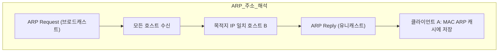

## IPv4 주소 체계의 기본 개념

IPv4는 인터넷에서 장치를 식별할 때 사용하는 가장 기본적인 주소 체계입니다. IPv4 주소는 32비트로 구성되며, 보통 각 8비트씩 총 4개의 그룹으로 나누어 점(.)으로 구분하여 표기합니다.

- 예시: 192.168.1.1과 같은 형태
    
- 각 부분은 0에서 255까지의 값을 가지며, 이는 IPv4로 약 43억 개의 고유 주소를 표현할 수 있음을 의미합니다.
### 1. IPv4 주소의 구성 요소

IPv4 주소는 네트워크 ID와 호스트 ID 두 가지로 구성됩니다.
- **네트워크 ID**는 특정 네트워크 전체를 나타내는 주소로, 마치 아파트의 전체 주소와 유사한 개념입니다.
    
- **호스트 ID**는 특정 네트워크 내에서 각 개별 장치를 구분하는 데 사용되며, 아파트의 특정 세대번호와 비슷한 역할을 합니다.

 

---
## 패킷(Packet)의 개념

패킷은 네트워크의 Layer 3에서 사용되는 데이터의 전송 단위입니다. Layer 2에서 사용되는 Frame과 유사하지만 IP 프로토콜 계층에서 사용됩니다.

- **구성**: 패킷은 데이터를 담고 있는 Payload와 데이터를 전달하는 데 필요한 다양한 정보를 포함한 Header로 구성됩니다.
- **MTU (Maximum Transmission Unit)** 는 패킷이 전송될 수 있는 최대 크기이며, 일반적으로 1500 bytes로 설정됩니다.
	- MTU는 통상 1500 bytes를 의미하지만 필수적인 스펙은 아니어서, 어떤 패킷의 MTU는 1400 바이트일 수도, 4000일 수도 있다. 이와 같은 MTU의 차이는 후에 기술할 단편화 기술의 원인이 되기도한다.
	-  **매체·프로토콜이 정해 주는 ‘절대 상한’**
	    - IPv4 헤더의 Total Length 필드가 16 비트이므로 IP 패킷 크기는 이론적으로 65535 바이트가 한계다.
	- **장비-포트가 설정하는 ‘실제 값’**
	    - 절대 상한보다 작기만 하면, 라우터·스위치·서버 NIC 각각의 인터페이스별로 MTU를 마음대로 지정할 수 있다. 어떤 장비는 “시스템 전체 기본값”만 두고, 최신 장비는 포트마다 개별 숫자를 줄 수 있다. 운영체제 역시 각 NIC 단위로 조정한다.

패킷은 실제 택배 상자에 비유할 수 있으며, Header는 택배 상자에 붙은 송장으로 비유할 수 있습니다.

---
## Encapsulation과 Decapsulation

데이터가 네트워크를 통과할 때는 계층 구조를 거치면서 Header와 Trailer가 추가되거나 제거되는 과정을 거칩니다.

- **Encapsulation(캡슐화)** 은 데이터가 각 계층을 내려가면서 추가 정보가 더해지는 과정으로, 애플리케이션 데이터를 실제로 네트워크를 통해 전송할 수 있는 형태로 변환하는 과정입니다.
    - 예시: 애플리케이션 데이터(Stream) → TCP/IP 계층(Segment) → IP 계층(Packet) → Ethernet 계층(Frame)
- **Decapsulation(역캡슐화)** 은 목적지에서 각 계층을 거치면서 추가된 정보가 제거되고 원래 데이터 형태로 복원되는 과정입니다.

---
## 패킷의 생애주기
## **1. 패킷의 생성 과정**

패킷 생성은  데이터가 애플리케이션에서 소켓으로 넘어오면서 시작됩니다.

1. **데이터 읽기 및 버퍼 이동**
    - 프로세스가 디스크(HDD/SSD)에서 파일을 읽어들이면, 이 데이터는 프로세스 버퍼에 스트림(stream) 형태로 저장됩니다.
        
    - 이후 send() 호출 등을 통해 프로세스 버퍼의 내용이 소켓 입출력 버퍼로 복사됩니다.
2. **세그멘테이션 (L4 – TCP)**
    - 커널 모드로 넘어온 스트림 데이터는 TCP 스택에서 **세그먼트(segment)** 단위로 분할됩니다.
        
    - 이때 각 세그먼트에는 순서 번호가 부여되어, 이후 수신 측에서 올바르게 재조립할 수 있도록 돕습니다.
3. **캡슐화 (L3 – IP)**
    - 세그먼트가 IP 계층으로 전달되면, IP 헤더가 추가되어 **패킷(Packet)** 으로 완성됩니다.
        
    - IP 헤더에는 출발지·목적지 IP, 프로토콜 정보 등이 담겨 있습니다.

---

## **2. 패킷의 전달 및 관련 개념**

생성된 패킷이 네트워크를 통해 목적지까지 이동하는 과정입니다.

- **L2 프레임 캡슐화**
	- 패킷은 L3에서 L2 계층으로 내려오며 Ethernet 등 물리 네트워크에 맞는 **프레임(Frame)** 으로 다시 포장됩니다.
- **홉(Hop) 단위 전송**
	- 인터넷 상의 각 라우터는 목적지 IP를 확인한 뒤 최적의 경로로 패킷을 전달합니다. 이때 한 라우터를 지날 때마다 **TTL(Time To Live)** 값이 1씩 감소하여, TTL이 0이 되면 해당 라우터에서 패킷이 폐기됩니다.
- **단편화(Fragmentation)**
	- 경로상의 MTU(Maximum Transmission Unit)보다 패킷 크기가 크면, 라우터는 패킷을 여러 작은 조각으로 분할합니다. 단편화된 조각들은 최종 수신지에서 다시 합쳐집니다.
- **프레임의 변화**
	- 홉마다 사용하는 물리 매체나 프레임 형식(Ethernet, PPP 등)이 달라질 수 있지만, 내부의 IP 패킷 데이터는 그대로 유지됩니다.
- **TCP 레벨 관리**
    - TCP 통신 중에는 손실 감지(Loss), 재전송(Retransmission), 흐름 제어(Zero Window) 등 다양한 메커니즘이 작동하여 신뢰성 있는 데이터 전송을 보장합니다.
---

## **3. 패킷의 소멸 과정**.

1. **역캡슐화 (L2 → L3)**
    - NIC가 받은 프레임에서 IP 패킷을 추출합니다.
2. **패킷 소멸 및 세그먼트 추출**
    - IP 계층에서는 패킷 헤더를 제거하고, 내부의 TCP 세그먼트를 꺼냅니다.
        
    - 패킷은 더 이상 필요 없으므로 버려집니다.
3. **세그먼트 조립 및 상위 전달**
    - TCP 스택이 수신된 세그먼트를 순서대로 재조립한 뒤, 수신 소켓 버퍼에 적재합니다.
        
    - 애플리케이션은 receive() 호출을 통해 완성된 데이터를 읽어 처리합니다.

---
## IP 헤더의 주요 필드

- **Version**: 사용되는 IP 프로토콜 버전을 나타내며 주로 IPv4와 IPv6이 있습니다.
    
- **IHL(Internet Header Length)**: IP 헤더의 길이를 나타내며 일반적으로 20 bytes입니다.
    
- **TOS(Type of Service)**: 데이터 패킷이 제공받을 서비스의 우선순위를 나타냅니다.
    
- **Total Length**: 헤더와 데이터를 포함한 패킷의 전체 길이입니다.
    
- **Fragmentation**: 패킷이 전송 중 분할되는 경우 필요한 정보를 포함합니다.
    
- **TTL(Time To Live)**: 패킷의 생존 시간을 나타내며, 패킷이 라우터를 지날 때마다 값이 하나씩 감소합니다.
    
- **Protocol**: 패킷의 상위 계층 프로토콜(예: TCP, UDP)을 나타냅니다.
    
- **Header Checksum**: 헤더의 오류 검사를 위한 값입니다.
    
- **Source IP**: 송신자의 IP 주소입니다.
    
- **Destination IP**: 수신자의 IP 주소입니다.

https://www.rfc-editor.org/rfc/rfc791.html#section-3.1
---
## 마스크와 CIDR

서브넷 마스크는 IP 주소에서 네트워크 ID와 호스트 ID를 구분하는 데 사용됩니다. CIDR은 기존의 클래스 기반 IP 주소 체계를 대체하여 보다 효율적으로 IP 주소를 할당할 수 있게 해줍니다.

- 예시: 192.168.100.10/24는 앞의 24비트가 네트워크 ID임을 나타냅니다
---
## 특별한 IP 주소

### **브로드캐스트 IP**: 네트워크 내 모든 장치에 데이터를 전송하기 위한 주소로, 해당 네트워크의 모든 호스트 ID를 1로 설정합니다.
- **리미티드 브로드캐스트 (255.255.255.255)** 는  로컬 링크에만 도달합니다. 라우터가 절대 포워딩하지 않기 때문에, 어떤 네트워크에 연결되어 있는지조차 모르는 상태에서 모든 호스트에게 한번에 메시지를 전파할 때 사용됩니다.
	
- **디렉티드 브로드캐스트**는 특정 서브넷 전체를 겨냥해, 네트워크 ID 뒤의 호스트 비트를 모두 1로 채운 주소(예: 192.168.1.255 for /24)를 목적지로 삼습니다. 하지만 보안상의 이유로 대부분의 라우터는 기본 설정에서 이를 차단해 리미티드 브로드캐스트처럼 로컬 링크까지만 동작하게 하고, 관리자가 명시적으로 허용해야만 포워딩합니다.
	
- **이후 L2(데이터 링크) 브로드캐스트**를해 이더넷 헤더의 목적지 MAC 주소가 FF:FF:FF:FF:FF:FF로 설정된 프레임을 스위치가 전파합니다. 스위치는 단지 “모든 포트로 내보내라”는 수준의 동작만 하며 라우터나 L3 경계에서는 이 브로드캐스트 프레임을 절대 통과시키지 않습니다.ㅅㄷㄴㅅ
### **루프백 주소**: 호스트 자신과의 내부 통신을 위해 사용됩니다.
- 대표적 주소: 127.0.0.1

---
## 주요 프로토콜

- **DHCP(Dynamic Host Configuration Protocol)**: 네트워크에 연결된 장치가 IP 주소 및 필요한 네트워크 정보를 자동으로 제공받을 수 있게 해줍니다.

- **ARP(Address Resolution Protocol)**: IP 주소로부터 해당 장치의 물리적 주소(MAC 주소)를 찾아줍니다.
    - IP 패킷을 Ethernet 프레임으로 전송하려면, 목적지 장치의 MAC 주소가 반드시 필요합니다.
    - ARP는 “이 IP를 가진 장치의 MAC 주소가 뭐야?”라는 질문을 **브로드캐스트**로 던져서, 해당 호스트로부터 MAC 주소를 **유니캐스트 ARP Reply**로 얻어 옵니다.
    - **이더넷의 MAC 헤더** 목적지 주소는 “내가 보내야 할 다음 홉” 로컬 서브넷이 아니면 **기본 게이트웨이(gateway)** 의 MAC으로 설정합니다.

## 네트워크 성능 지표 (RTT)

RTT(Round Trip Time)는 패킷을 목적지에 보내고 응답을 받기까지 걸리는 왕복 시간을 의미합니다. RTT는 네트워크의 속도와 안정성을 평가하는 데 중요한 지표이며, ping과 같은 도구로 측정 가능합니다.